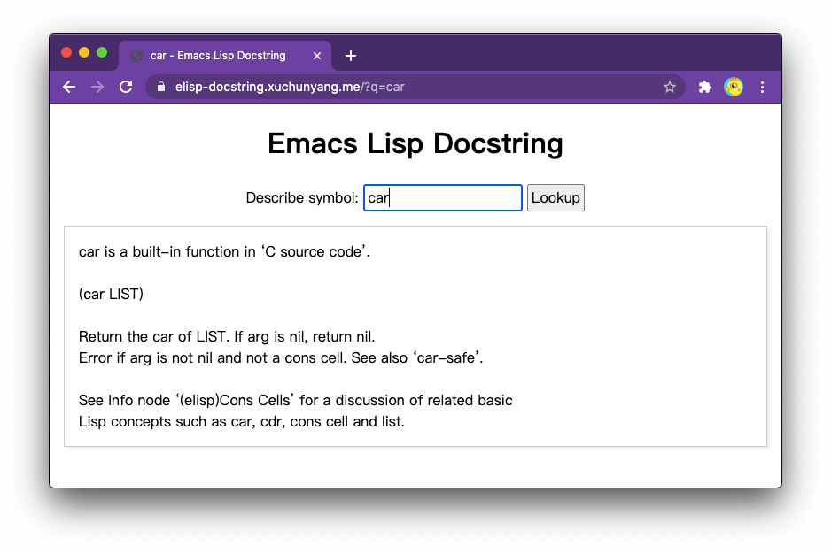

# Emacs Lisp Docstring Server

elisp-docstring-server.el provides a web server for Emacs Lisp Docstring.

the above screenshot is showing https://elisp-docstring.xuchunyang.me/?q=car

## Usage

1. M-x elisp-docstring-server-start
2. http://localhost:3000

### Run in Docker
1. execute `docker build -t elisp-docstring-server .` to build the image
2. execute `docker run --name elisp-docstring-server -d -p 3000:3000 elisp-docstring-server` to run the container
3. Browse `http://localhost:3000`
4. execute `docker exec elisp-docstring-server emacsclient -e "(require 'url-http)"` to load extra libraries

## Demo

https://elisp-docstring.xuchunyang.me/

Emacs => Varnish (for cache) => Caddy (for HTTPS)

## Requires

- Emacs 25.1 or later
- https://github.com/eschulte/emacs-web-server (M-x package-install web-server)
